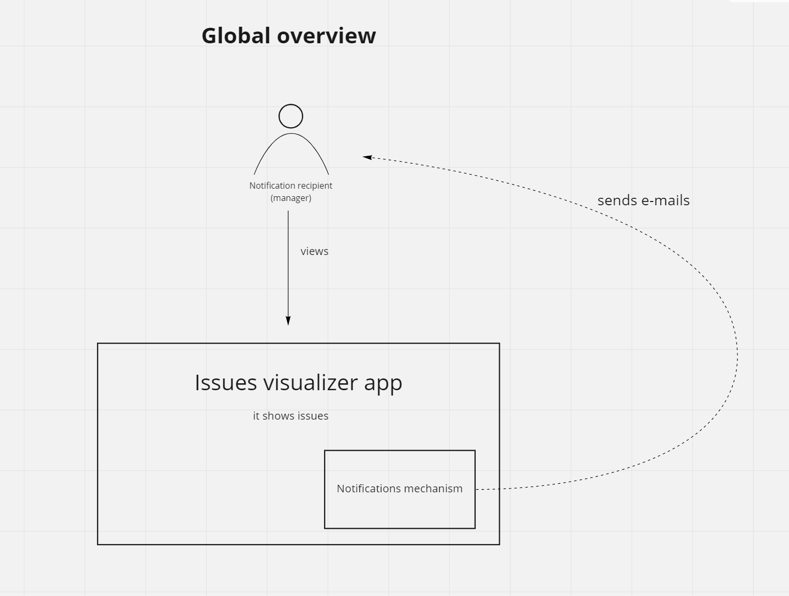
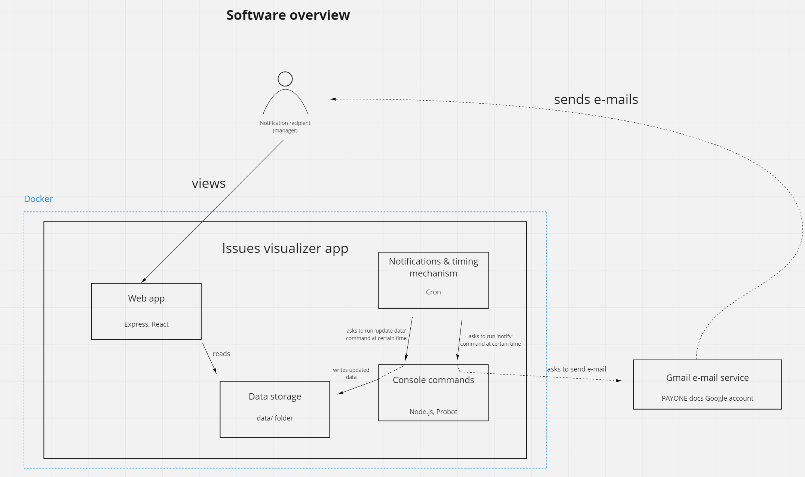

# PAYONE GitHub issues visualizer app
This app visualizes our current GitHub issues
and notifies about the state of the issues.

This app consists of the following parts:
  - Web app - `web/` folder
  - Console commands - `commands/` folder
  - Data storage - `data/` folder

The app uses:
  - GitHub's API, GitHub's framework Probot
  - Node.js for console commands
  - Express web server and React JS framework for the web app
  - Docker (the app can be run inside a Docker container)

## Overview diagrams
### Global overview

### Software overview


## Text overview
### Web app
This app's web server (Express) should be run continuously. If running 
simply via Node.js, it is achieved with `npm run start` command.
If running via Docker, it is achieved with `&` ampersand operator inside
`_docker/start-app.sh` when setting up the web server (line 6). `&` operator allows to 
keep the program in the background - this is what we want.

The web application is served via a simple Express web server. If you want
to add additional routes to the web app, simply do it via changing `app.js`
with `app.use()` method like it is done on lines 15-17.

The React app is not even a full-fledged Webpack bundled app. Instead, it uses
simple `<script src="path/to/Component.js" type="text/babel">` scripts to run.
I decided to go with this way because the app itself isn't very big, so this approach
is sufficient. But we could also use a bundler like Webpack or `create-react-app` here.

### Data storage
The web app reads data from `data/latest` folder.

This folder itself is updated via console command (script) `commands/commands/update.js`.

And the folder contains `notifications-recipients.json` file that holds
information about the people who should get notified about the state of 
the issues.

Also, we have `_previous` folder here. It holds the previous version of the data.
Just in case.

### Console commands
This part of the app consists of two commands (scripts) - `commands/update.js` and `commands/notify.js`.

`update` command updates the issues' data inside `data/latest/*.json` files.

`notify` command notifies the notifications recipients. Currently, we use e-mails via a 
Gmail account.

These commands themselves are run at certain time via **cron**. If running the app via Docker,
the cron is automatically set up. If running the app via only the host machine, you should 
set up cron by yourself. The cron commands can be found in `_docker/cron_jobs.txt`

## Running the app
First of all, we'll need to provide `commands/.env` file with the needed credentials
and data.

### Development
#### Locally via your machine
Populate the `commands/.env` file.

Then, to develop the web app, simply go to `web/` and run `npm run start`.
And then you can start developing the web app. To see the changes from React,
you'll need to reload the page manually.

To develop the console commands part, just change the code and try running the commands
via `node <script>.js`.

To set up the cron to work with console commands, you have to set up the cron with the
commands from `_docker/cron_jobs.txt`.

#### Locally via Docker
Populate the `commands/.env` file.

And you don't have to do all that hustle if your run the app with Docker. You can simply
issue `docker-compose -f docker-compose.development.yml up -d` command in the root of the project.

##### Why two separate files for docker-compose?
Because the guys like to spin up their apps on the servers
using simple `docker-compose up -d` command. But the deployment instructions are a bit different from
the regular development process. That's why we have two separate docker-compose files:
  - `docker-compose.development.yml` for development
  - `docker-compose.yml` for the servers (like Aztec)

### Deployment
Populate the `commands/.env` file.

Then, to set up the web app, simply go to `web/` and run `npm run start`.

To set up cron to work with the console commands, you need to set it up on your machine
and paste the commands from `_docker/cron_jobs.txt`
 
#### Deployment on Aztec
Populate the `commands/.env` file.

On Aztec, we only run this app via Docker to make use of Traefik (a reverse proxy for Aztec).
So, to run the app, go to the project's folder (currently `/srv/payone-github-issues-visualizer-app`)
and run `docker-compose up -d`.

The `docker-compose.yml` is a bit different from `docker-compose.development.yml` because it has
some instructions for Traefik.

##### A note on using Git and Git password
Most probably you will need to set up a token to pull from the GitHub origin
repository. I.e., when you want to update the deployed project (pull the changes),
GitHub will ask you this:
```
Password for 'https://AlexDz27@github.com': 
```
And here, instead of your password, you should use a token that you can set up
by following [this doc](https://docs.github.com/en/authentication/keeping-your-account-and-data-secure/creating-a-personal-access-token).

## Notes
### On Docker
Be careful about the ports - the current mapping is
`3011:3000`. It means that the app would run on port `3011` on the
host machine.

## Troubleshooting (in case you do encounter something)
### Permission denied `all_issues.json`
```js
node:fs:585
  handleErrorFromBinding(ctx);
  ^

Error: EACCES: permission denied, open '/home/alex/Projects/Serious/PayOne3/payone-github-issues-tracker-app/commands/commands/../../data/latest/all_issues.json'
    at Object.openSync (node:fs:585:3)
    at Object.writeFileSync (node:fs:2153:35)
    at /home/alex/Projects/Serious/PayOne3/payone-github-issues-tracker-app/commands/commands/notify.js:83:6 {
  errno: -13,
  syscall: 'open',
  code: 'EACCES',
  path: '/home/alex/Projects/Serious/PayOne3/payone-github-issues-tracker-app/commands/commands/../../data/latest/all_issues.json'
}
```
While I was developing locally, I stumbled on this error. It happened due to Linux’s nature - if root user (Docker in our case) changes a file, the file is then owned by root, and a regular user
(me while I was running ‘notify’ command locally) is not able to change the file later on - that’s why I stumbled on this error.
I don’t think it actually *needs* a fix, because that’s how Docker runs. If you develop under Docker, you won’t see this error. If you develop without using Docker, make sure you have proper rights. So, I fixed this simply via `chmod 777 all_issues.json general_data.json stale_issues.json` inside the `latest` folder.

### Cannot find module `/app/commands/commands/update.js` (cron related error)

```js
racker-app_1  | Error: Cannot find module '/app/commands/commands/update.js
tracker-app_1  |     at Function.Module._resolveFilename (internal/modules/cjs/loader.js:815:15)
tracker-app_1  |     at Function.Module._load (internal/modules/cjs/loader.js:667:27)
tracker-app_1  |     at Function.executeUserEntryPoint [as runMain] (internal/modules/run_main.js:60:12)
tracker-app_1  |     at internal/main/run_main_module.js:17:47 {
tracker-app_1  |   code: 'MODULE_NOT_FOUND',
tracker-app_1  |   requireStack: []
tracker-app_1  | }
```

When running cron jobs, there could be an error that tells us that node can’t find a module (file). This is a very sneaky and dirty bug... because the error was that I developed under WSL, and Windows left
strange `^M` character at the end of new line:

```js
cat -ev /etc/crontabs/root
* * * * * node /app/commands/commands/update.js^M$
* * * * * node /app/commands/commands/notify.js
```

The above output shows that when running `cat` command, we can see that sneaky `^M`. This is related to how different OS’s treat newlines. For more info, check out section ‘Cause’  [here](https://support.microfocus.com/kb/doc.php?id=7014821).
Fix: I simply went into my Vim editor and rewrote the whole text anew - and the issue was fixed

### ‘useState’ error in `main.js` that points to nothing

It is invoked due to use of `import/export` statements. So, if you want to continue developing this app via `<script>` tags instead of using a build tool like Webpack, then don’t use `import/export` statements in your code.
That’s why currently there are no `import/export` statements inside components.